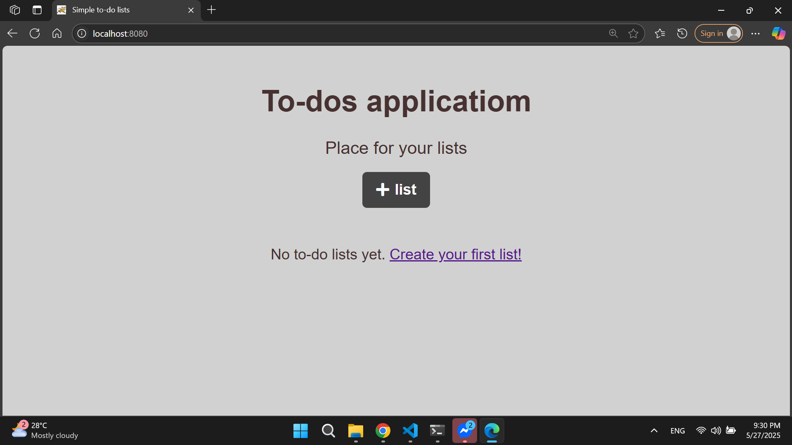
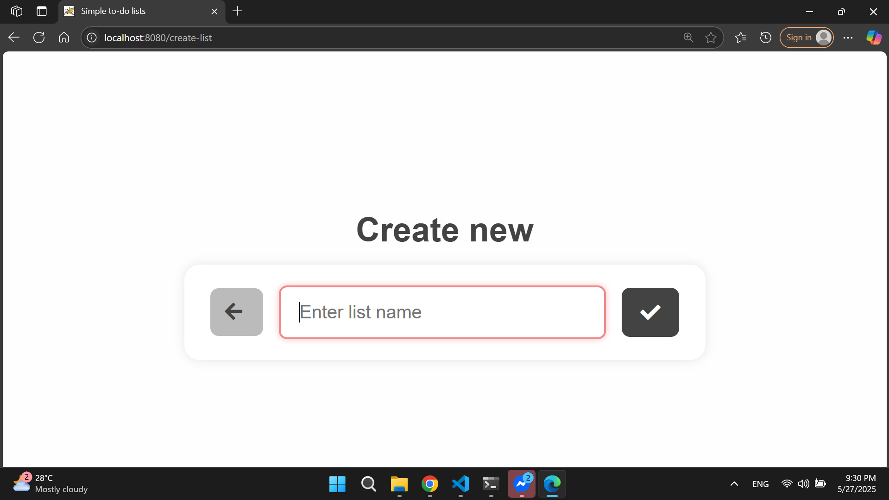
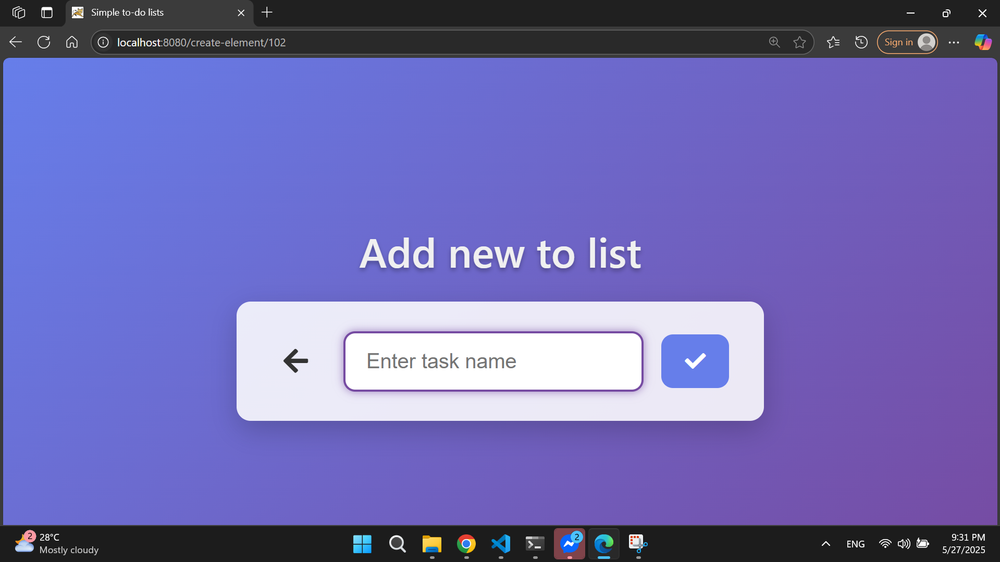
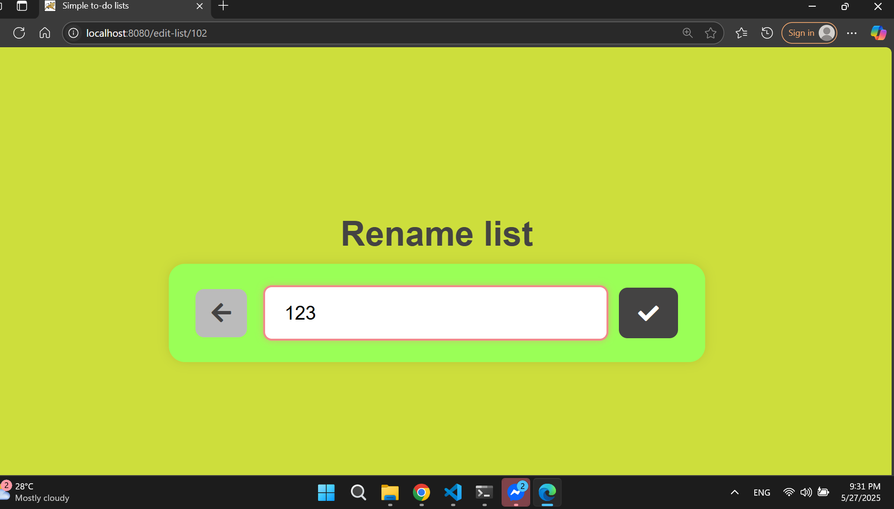
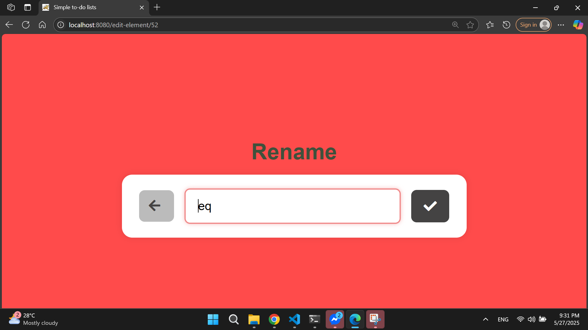

# todolist_app

### BASIC ELEMENTS:
Generated a template using https://start.spring.io/.

### —— Application dependencies —— 

- Spring Web
- Spring Data JPA
- Thymeleaf
- Validation
- Spring Devtools

### —— Configuration ——

Defaul port `8080`.

In `application.properties` 
- Configure Thymeleaf cache
- Configure JPA

### —— Backend —— 

**1. Entities**
```
class ToDoList {
    Long id;
    List <Element> elements
    String listName
}
```
```
class ToDoElement {
    Long id
    ToDoList todoList;
    String name;
    Boolean isDone;
}

```

### RELATIONSHIPS:
_**ONE** `List` can have **MANY** `Elements`._

In `ToDoList`:

```
@OneToMany(mappedBy = "toDoList", cascade = CascadeType.ALL, orphanRemoval = true)
private List<ToDoElement> toDoElements = new ArrayList<>();
```
- `mappedBy` - to indicate field name in `ToDoElement` class
- `CascadeTyde.All` - all actions done on `ToDoList` will be cascaded to children
- `orphanRemoval` - in case `ToDoList` will be deleted, all child elements will be deleted, too.

In `ToDoElement`:
```
@ManyToOne
@JoinColumn(name = "toDoList_Id")
private ToDoList toDoList;
```
- `name` of the foreign key in the table

**2. Repositories** 

What actions will need?
| Action | Repository | Method |
| --- | --- | --- |
| Add list | ToDoListRepository | ToDoList save(ToDoList toDoList) |
| Delete list | ToDoListRepository | void delete(ToDoList entity) |
| Edit name of the list | ToDoListRepository | ToDoList save(ToDoList toDoList) |
| Find list | ToDoListRepository | Optional<ToDoList> findById(Long id) |
| Find all lists | ToDoListRepository | List<ToDoList> findAll() |
| Add element to the list | ToDoElementRepository | ToDoElement save(ToDoElement toDoElement) - (setting ToDoList beforehand) |
| Delete element from the list | ToDoElementRepository | void delete(ToDoElement toDoElement) |
| Mark element as done | ToDoElementRepository | ToDoElement save(ToDoElement toDoElement) - (setting boolean beforehand) |
| Edit name of the element  | ToDoElementRepository | ToDoElement save(ToDoElement toDoElement) - (setting new name beforehand) |
| Find element | ToDoElementRepository | Optional<ToDoElement> findById(Long id) |

**3. Controller**

Start from Home Page Controller with `@GetMapping(“/)` method
- Returns ModelAndView object - object for rendering views with associated data. 
- “home” argument in the constructor - name of the “View” (so name of the html file). 
- addObject method adds some data to the Model. “toDoLists” is keyword that will be used to refer to that data in HTML file, toDoListRepository.findAll() is the data itself)

### —— Frontend ——

`home.html`

Responsible for home page
- In `head` configure encoding, colours, and viewport to be visible from different devices
- In `body` is a heading, and then `div` (element) of each list and its elements in a form of a table. Lists are extracted using `Thymeleaf`:
  - `<div th:each = "list : ${toDoLists}"></div>` - element where program is iterating through all the lists
  - `th:href="@{/create-element/{id}(id=${list.id})}` - create a reference using `id` field of `list` object
  - `<tr th:each="element : ${list.toDoElements}"></tr>` - show rows with help of elements' iteration, got from the `toDoElements` field of `list` object
  - `<span th:if="${element.isDone}"></span>` or `<span th:unless="${element.isDone}"></span>` for conditions
  - `th:text="${element.name}"` show `name` of the `element`
  - `th:object="${toDoList}"` or `th:field="${toDoList.name}"` object or field reference

### —— Test run ——

`Error: Table "LISTS" not found (this database is empty);` -> Don’t forget to put in `application.properties` the following:
```
spring.jpa.hibernate.ddl-auto=create-drop
```
*“The values create, create-drop, validate, and update basically influence how the schema tool management will manipulate the database schema at startup.”*

### —— Additional Features ——

**1. Button to add the list**
- under the heading 
- when you click on it, it opens new page where you fill information on new list


**2. Button to add new element to the list**
- at the end of each list
- when you click on it, it opens new page where you fill information on new element

**3. Ability to complete the element**
- before name of the element
- button “Done!”
- When element is done, it has strikethrough effect
- when click again, the element is “undone”

**4. Edit button to the list to edit name and delete list**
- to the left of the list
- 2 separate buttons, one for Delete, another for Edit. 

**5. Edit button to each of the elements to edit name or delete element**

**6. Done button must change to “Undone” button if task is completed**

Added extra conditional wrapper around “Done” button. The functionality of the button is the same, the only difference is title of the button.

Home page:



Create new list/element:



Rename list/element:


**2. CSS**
- Make correct positions of elements 
  - Move Back buttons in edit and create pages
  - Center all titles, formes, and +list button
  - Create space between lists
  - Make lists in one row, not in one column

- Make everything prettier
  - Change font
  - Make everything bigger
  - Make appropriate buttons (where needed - change colours, or make invisible background)

## Result:
Home:


New list/element:




Edit list/element:




